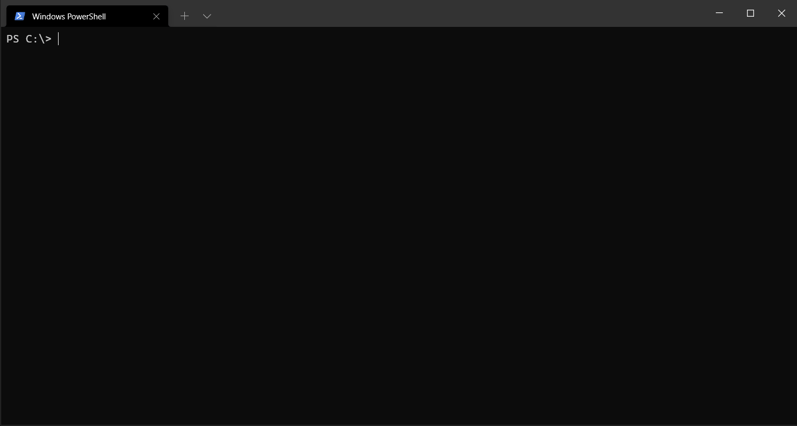
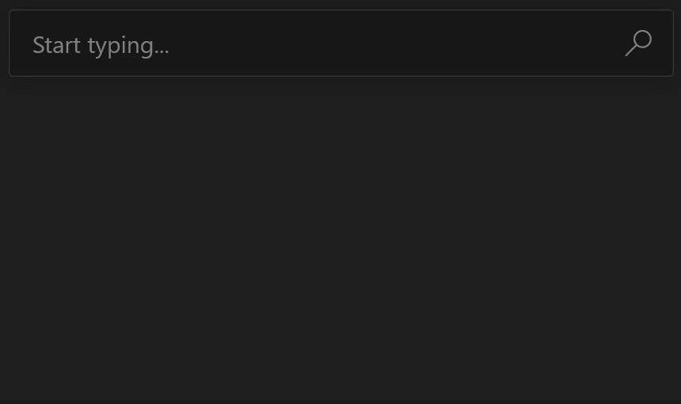
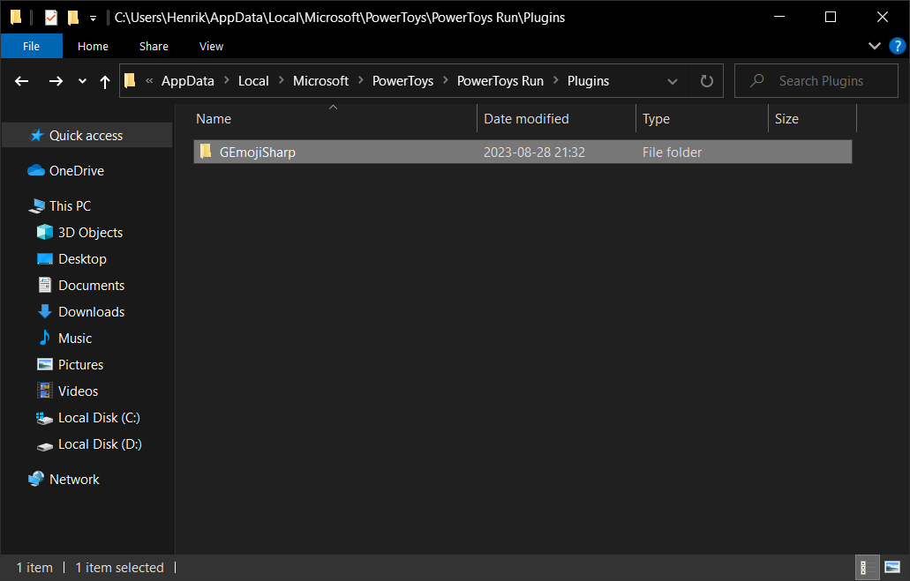
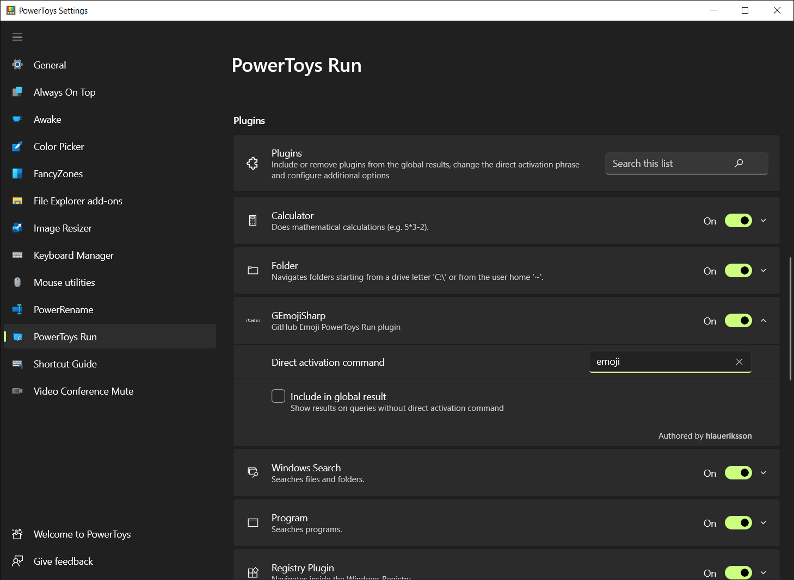
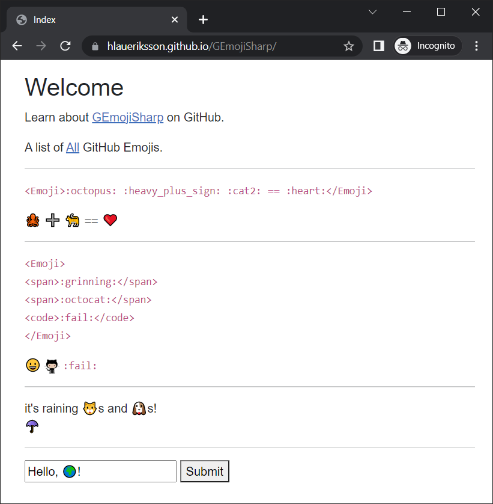

# GEmojiSharp<!-- omit in toc -->

[](https://github.com/hlaueriksson/GEmojiSharp/actions?query=workflow%3Abuild)
[](https://www.codefactor.io/repository/github/hlaueriksson/gemojisharp)

[](https://www.nuget.org/packages/GEmojiSharp)
[](https://www.nuget.org/packages/GEmojiSharp.AspNetCore)
[](https://www.nuget.org/packages/GEmojiSharp.Blazor)
[](https://www.nuget.org/packages/GEmojiSharp.DotnetTool)

> GitHub Emoji for C#, ASP.NET Core and Blazor, dotnet tool for the terminal and PowerToys Run plugin

```txt
🐙 :octopus:
➕ :heavy_plus_sign:
🐈 :cat2:
⩵
❤️ :heart:
```

## Content<!-- omit in toc -->

- [Introduction](#introduction)
- [`GEmojiSharp` 📦](#gemojisharp-)
- [`GEmojiSharp.AspNetCore` 📦](#gemojisharpaspnetcore-)
  - [TagHelpers](#taghelpers)
  - [HtmlHelpers](#htmlhelpers)
- [`GEmojiSharp.Blazor` 📦](#gemojisharpblazor-)
- [`GEmojiSharp.DotnetTool` 🧰](#gemojisharpdotnettool-)
  - [Installation](#installation)
  - [Usage](#usage)
- [`GEmojiSharp.PowerToysRun` 🧰](#gemojisharppowertoysrun-)
  - [Installation](#installation-1)
  - [Usage](#usage-1)
  - [Configuration](#configuration)
- [Samples](#samples)
- [Upgrading](#upgrading)
- [Attribution](#attribution)

## Introduction

[Using emoji](https://help.github.com/en/articles/basic-writing-and-formatting-syntax#using-emoji) on GitHub is accomplish with emoji aliases enclosed by colons:

`:+1: This PR looks great - it's ready to merge! :shipit:`

:+1: This PR looks great - it's ready to merge! :shipit:

`GEmojiSharp`, `GEmojiSharp.AspNetCore` and `GEmojiSharp.Blazor` are three libraries to make this possible in C#, Blazor and ASP.NET Core.

A list of all GitHub Emojis:

- https://github.com/hlaueriksson/github-emoji

## `GEmojiSharp` 📦

[](https://www.nuget.org/packages/GEmojiSharp/)

> GitHub Emoji for C# and .NET

Static methods:

```csharp
Emoji.Get(":tada:").Raw; // 🎉
Emoji.Get("🎉").Alias(); // :tada:
Emoji.Raw(":tada:"); // 🎉
Emoji.Alias("🎉"); // :tada:
Emoji.Emojify(":tada: initial commit"); // 🎉 initial commit
Emoji.Demojify("🎉 initial commit"); // :tada: initial commit
Emoji.Find("party popper").First().Raw; // 🎉
```

Extension methods:

```csharp
":tada:".GetEmoji().Raw; // 🎉
"🎉".GetEmoji().Alias(); // :tada:
":tada:".RawEmoji(); // 🎉
"🎉".EmojiAlias(); // :tada:
":tada: initial commit".Emojify(); // 🎉 initial commit
"🎉 initial commit".Demojify(); // :tada: initial commit
"party popper".FindEmojis().First().Raw; // 🎉
```

Regular expression pattern to match all emojis:

```csharp
var text = "Lorem 😂😂 ipsum";

var matches = Regex.Matches(text, Emoji.RegexPattern);
string.Join(string.Empty, matches.Select(x => x.Value)); // 😂😂

Regex.Replace(text, Emoji.RegexPattern, string.Empty); // Lorem  ipsum
```

## `GEmojiSharp.AspNetCore` 📦

[](https://www.nuget.org/packages/GEmojiSharp.AspNetCore/)

> GitHub Emoji for ASP.NET Core

The package includes:

- TagHelpers
- HtmlHelpers

### TagHelpers

Update the `_ViewImports.cshtml` file, to enable tag helpers in all Razor views:

```cshtml
@addTagHelper *, GEmojiSharp.AspNetCore
```

Use the `<emoji>` tag or `emoji` attribute to render emojis:

```html
<span emoji=":tada:"></span>
<emoji>:tada: initial commit</emoji>
```

Standard emoji characters are rendered like this:

```html
<g-emoji class="g-emoji" alias="tada" fallback-src="https://github.githubassets.com/images/icons/emoji/unicode/1f389.png">🎉</g-emoji>
```

Custom GitHub emojis are rendered as images:

```html

```

Use CSS to properly position the custom GitHub emojis images:

```css
.emoji {
    background-color: transparent;
    max-width: none;
    vertical-align: text-top;
}
```

Use the JavaScript from [`g-emoji-element`](https://github.com/github/g-emoji-element) to support old browsers.

> Backports native emoji characters to browsers that don't support them by replacing the characters with fallback images.

Add a [`libman.json`](https://docs.microsoft.com/en-us/aspnet/core/client-side/libman/libman-vs?view=aspnetcore-6.0) file:

```json
{
  "version": "1.0",
  "defaultProvider": "cdnjs",
  "libraries": [
    {
      "provider": "unpkg",
      "library": "@github/g-emoji-element@1.1.5",
      "destination": "wwwroot/lib/g-emoji-element/"
    }
  ]
}
```

And add the script to the `_Layout.cshtml` file:

```html
<script src="~/lib/g-emoji-element/dist/index.js"></script>
```

Do you want to use emoji anywhere, on any tag, in the `body`? Then you can use the `BodyTagHelperComponent`.

Use any tag to render emojis:

```html
<h1>Hello, :earth_africa:</h1>
```

[Registration](https://docs.microsoft.com/en-us/aspnet/core/mvc/views/tag-helpers/th-components?view=aspnetcore-6.0#registration-via-services-container) via services container:

```cs
using GEmojiSharp.AspNetCore;
using Microsoft.AspNetCore.Razor.TagHelpers;

var builder = WebApplication.CreateBuilder(args);

builder.Services.AddRazorPages();
builder.Services.AddTransient<ITagHelperComponent, BodyTagHelperComponent>();
```

[Registration](https://docs.microsoft.com/en-us/aspnet/core/mvc/views/tag-helpers/th-components?view=aspnetcore-6.0#registration-via-razor-file) via Razor file:

```cshtml
@page
@model GEmojiSharp.Sample.Web.Pages.ComponentModel
@using Microsoft.AspNetCore.Mvc.Razor.TagHelpers
@using GEmojiSharp.AspNetCore
@inject ITagHelperComponentManager manager;
@{
    ViewData["Title"] = "Component";
    manager.Components.Add(new BodyTagHelperComponent());
}
```

[Registration](https://docs.microsoft.com/en-us/aspnet/core/mvc/views/tag-helpers/th-components?view=aspnetcore-6.0#registration-via-page-model-or-controller) via Page Model or controller:

```cs
using GEmojiSharp.AspNetCore;
using Microsoft.AspNetCore.Mvc.Razor.TagHelpers;
using Microsoft.AspNetCore.Mvc.RazorPages;

namespace GEmojiSharp.Sample.Web.Pages
{
    public class ComponentModel : PageModel
    {
        private readonly ITagHelperComponentManager _tagHelperComponentManager;

        public IndexModel(ITagHelperComponentManager tagHelperComponentManager)
        {
            _tagHelperComponentManager = tagHelperComponentManager;
        }

        public void OnGet()
        {
            _tagHelperComponentManager.Components.Add(new BodyTagHelperComponent());
        }
    }
}
```

### HtmlHelpers

Update the `_ViewImports.cshtml` file, to enable HTML helpers in all Razor views:

```cshtml
@using GEmojiSharp.AspNetCore
```

Use the `Emoji` extension methods to render emojis:

```cshtml
@Html.Emoji(":tada: initial commit")
@Html.Emoji(x => x.Text)
```

## `GEmojiSharp.Blazor` 📦

[](https://www.nuget.org/packages/GEmojiSharp.Blazor/)

> GitHub Emoji for Blazor

The package is a Razor class library (RCL) with a Razor component.

Update the `_Imports.razor` file, to enable the component in all Razor views:

```cshtml
@using GEmojiSharp.Blazor
```

Use the `<Emoji>` component to render emojis:

```html
<Emoji>:tada: initial commit</Emoji>
```

Standard emoji characters are rendered like this:

```html
<g-emoji class="g-emoji" alias="tada" fallback-src="https://github.githubassets.com/images/icons/emoji/unicode/1f389.png">🎉</g-emoji>
```

Custom GitHub emojis are rendered as images:

```html

```

## `GEmojiSharp.DotnetTool` 🧰

[](https://www.nuget.org/packages/GEmojiSharp.DotnetTool/)

> GitHub Emoji dotnet tool



### Installation

Install:

```cmd
dotnet tool install -g GEmojiSharp.DotnetTool
```

Update:

```cmd
dotnet tool update -g GEmojiSharp.DotnetTool
```

Uninstall:

```cmd
dotnet tool uninstall -g GEmojiSharp.DotnetTool
```

### Usage

```cmd
emoji --help
```

```cmd
Description:
  GitHub Emoji dotnet tool

Usage:
  emoji [command] [options]

Options:
  --version       Show version information
  -?, -h, --help  Show help and usage information

Commands:
  r, raw <args>       Get raw emojis
  a, alias <args>     Get emoji aliases
  e, emojify <args>   Replace aliases in text with raw emojis
  d, demojify <args>  Replace raw emojis in text with aliases
  export <args>       Export emoji data to <json|toml|xml|yaml>
```

#### Raw<!-- omit in toc -->

```cmd
emoji raw --help
```

```cmd
Description:
  Get raw emojis

Usage:
  emoji raw [<args>...] [options]

Arguments:
  <args>  Find emojis via description, category, alias or tag

Options:
  -c, --copy      Copy to clipboard
  -?, -h, --help  Show help and usage information
```

<details>
<summary>💁 Examples:</summary>

Get raw emojis:

```cmd
emoji raw "grinning cat"
emoji raw grinning cat
emoji r grinning cat
```

```cmd
😺
😸
```

Copy to clipboard:

```cmd
emoji raw "grinning cat" --copy
emoji r grinning cat -c
```

```txt
😺😸
```

</details>

#### Alias<!-- omit in toc -->

```cmd
emoji alias --help
```

```cmd
Description:
  Get emoji aliases

Usage:
  emoji alias [<args>...] [options]

Arguments:
  <args>  Find emojis via description, category, alias or tag

Options:
  -c, --copy      Copy to clipboard
  -?, -h, --help  Show help and usage information
```

<details>
<summary>💁 Examples:</summary>

Get emoji aliases:

```cmd
emoji alias "grinning cat"
emoji alias grinning cat
emoji a grinning cat
```

```cmd
:smiley_cat:
:smile_cat:
```

Copy to clipboard:

```cmd
emoji alias "grinning cat" --copy
emoji a grinning cat -c
```

```txt
:smiley_cat::smile_cat:
```

</details>

#### Emojify<!-- omit in toc -->

```cmd
emoji emojify --help
```

```cmd
Description:
  Replace aliases in text with raw emojis

Usage:
  emoji emojify [<args>...] [options]

Arguments:
  <args>  A text with emoji aliases

Options:
  -c, --copy      Copy to clipboard
  -?, -h, --help  Show help and usage information
```

<details>
<summary>💁 Examples:</summary>

Replace aliases in text with raw emojis:

```cmd
emoji emojify ":tada: initial commit"
emoji emojify :tada: initial commit
emoji e :tada: initial commit
```

```cmd
🎉 initial commit
```

Copy to clipboard:

```cmd
emoji emojify ":tada: initial commit" --copy
emoji e :tada: initial commit -c
```

</details>

#### Demojify<!-- omit in toc -->

```cmd
emoji demojify --help
```

```cmd
Description:
  Replace raw emojis in text with aliases

Usage:
  emoji demojify [<args>...] [options]

Arguments:
  <args>  A text with raw emojis

Options:
  -c, --copy      Copy to clipboard
  -?, -h, --help  Show help and usage information
```

<details>
<summary>💁 Examples:</summary>

Replace raw emojis in text with aliases:

```cmd
emoji demojify "🎉 initial commit"
emoji demojify 🎉 initial commit
emoji d 🎉 initial commit
```

```cmd
:tada: initial commit
```

Copy to clipboard:

```cmd
emoji demojify "🎉 initial commit" --copy
emoji d 🎉 initial commit -c
```

</details>

#### Export<!-- omit in toc -->

```cmd
emoji export --help
```

```cmd
Description:
  Export emoji data to <json|toml|xml|yaml>

Usage:
  emoji export [<args>...] [options]

Arguments:
  <args>  Find emojis via description, category, alias or tag

Options:
  -f, --format <format>  Format the data as <json|toml|xml|yaml>
  -c, --copy             Copy to clipboard
  -?, -h, --help         Show help and usage information
```

Formats:

- `json`
- `toml`
- `xml`
- `yaml`

<details>
<summary>💁 Examples:</summary>

Export emoji data to `json`:

```cmd
emoji export "grinning cat" --format json
emoji export grinning cat --format json
emoji export grinning cat -f json
emoji export grinning cat
```

```json
[
  {
    "Raw": "😺",
    "Description": "grinning cat",
    "Category": "Smileys & Emotion",
    "Aliases": [
      "smiley_cat"
    ],
    "Tags": null,
    "UnicodeVersion": "6.0",
    "IosVersion": "6.0",
    "Filename": "1f63a",
    "IsCustom": false
  },
  {
    "Raw": "😸",
    "Description": "grinning cat with smiling eyes",
    "Category": "Smileys & Emotion",
    "Aliases": [
      "smile_cat"
    ],
    "Tags": null,
    "UnicodeVersion": "6.0",
    "IosVersion": "6.0",
    "Filename": "1f638",
    "IsCustom": false
  }
]
```

Copy to clipboard:

```cmd
emoji export "grinning cat" --format json --copy
emoji export "grinning cat" -c
```

</details>

## `GEmojiSharp.PowerToysRun` 🧰

[](https://github.com/hlaueriksson/GEmojiSharp/releases/download/v1.0.0/GEmojiSharp.PowerToysRun.1.0.0.zip)

> GitHub Emoji [PowerToys Run](https://docs.microsoft.com/en-us/windows/powertoys/run) plugin



### Installation

The plugin is developed and tested with `PowerToys` `v0.57.2`.

Install:

0. [Install PowerToys](https://docs.microsoft.com/en-us/windows/powertoys/install)
1. Exit PowerToys
2. Download [GEmojiSharp.PowerToysRun.1.0.0.zip](https://github.com/hlaueriksson/GEmojiSharp/releases/download/v1.0.0/GEmojiSharp.PowerToysRun.1.0.0.zip) and extract it to:
   - `%ProgramFiles%\PowerToys\modules\launcher\Plugins`
3. Start PowerToys



### Usage

1. Open PowerToys Run with `alt + space`
2. Type `emoji`
   - A list of all emojis will be displayed
3. Continue to type to find emojis via description, category, alias or tag
4. Use ⬆️ and ⬇️ keys to select an emoji
5. Press `Enter` to copy the selected raw emoji to clipboard
6. Press `ctrl + c` to copy the selected emoji aliases to clipboard

Emojify:

- You can paste a text containing emoji aliases to replace them with raw emojis

Demojify:

- You can paste a text containing raw emojis to replace them with aliases

### Configuration

Change action keyword:

1. Open PowerToys
2. Select PowerToys Run
3. Scroll down to Plugins
4. Expand `GEmojiSharp`
5. Change *Direct activation command*



## Samples

The [`samples`](/samples) folder contains...

- `GEmojiSharp.Sample.BlazorServer`, a Blazor Server app
- `GEmojiSharp.Sample.BlazorWebAssembly`, a Blazor WebAssembly app
- `GEmojiSharp.Sample.Web`, a ASP.NET Core web site

The Blazor WebAssembly app is showcased here:

- https://hlaueriksson.github.io/GEmojiSharp/ (GitHub Pages)
- https://purple-mushroom-05c6bad10.azurestaticapps.net (Azure Static Web Apps)

[](https://hlaueriksson.github.io/GEmojiSharp/)

## Upgrading

> ⬆️ Upgrading from version `1.5.0` to `2.0.0`

Upgrade `GEmojiSharp.TagHelpers`:

- Uninstall `GEmojiSharp.TagHelpers`
- Install `GEmojiSharp.AspNetCore`
- Replace references to ~~`GEmojiSharp.TagHelpers`~~ with `GEmojiSharp.AspNetCore`:

  ```diff
  - @addTagHelper *, GEmojiSharp.TagHelpers
  + @addTagHelper *, GEmojiSharp.AspNetCore
  ```

  ```diff
  - @using GEmojiSharp.TagHelpers
  + @using GEmojiSharp.AspNetCore
  ```

  ```diff
  - using GEmojiSharp.TagHelpers;
  + using GEmojiSharp.AspNetCore;
  ```

Upgrade `GEmojiSharp.Blazor`:

- Remove reference to the `css` file:

  ```diff
  - <link href="_content/GEmojiSharp.Blazor/style.css" rel="stylesheet" />
  ```

- Remove reference to the `js` file:

  ```diff
  - <script src="_content/GEmojiSharp.Blazor/script.js"></script>
  ```

## Attribution

Repositories consulted when building this:

- https://github.com/github/gemoji
- https://github.com/github/g-emoji-element
- https://github.com/dotnet/command-line-api
- https://github.com/microsoft/PowerToys
